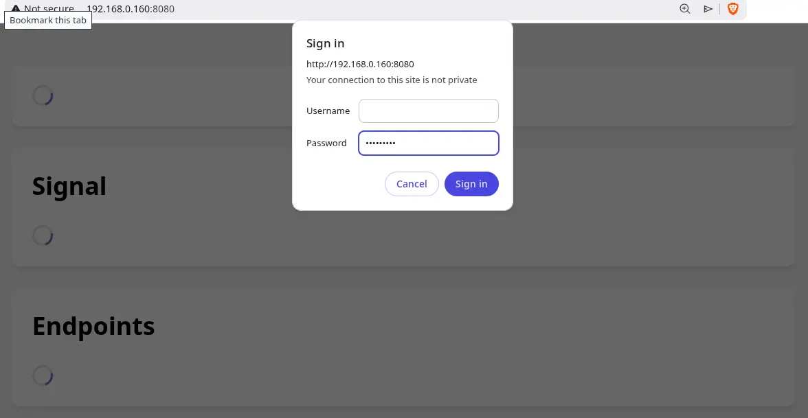
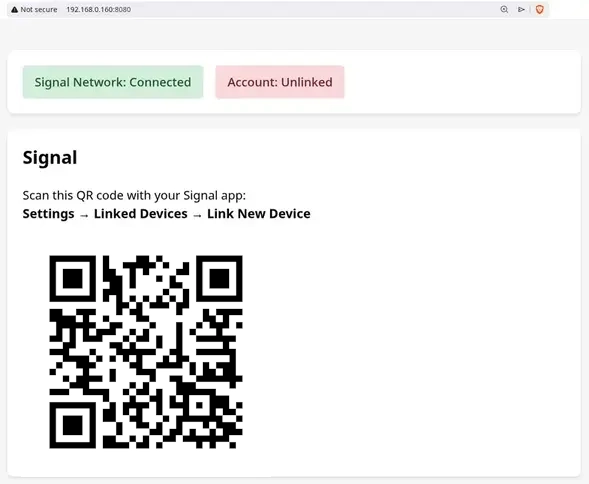
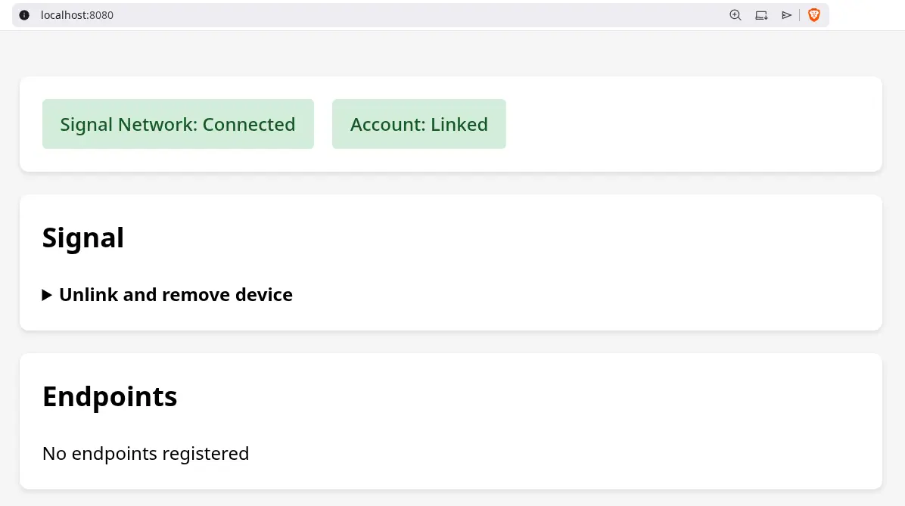
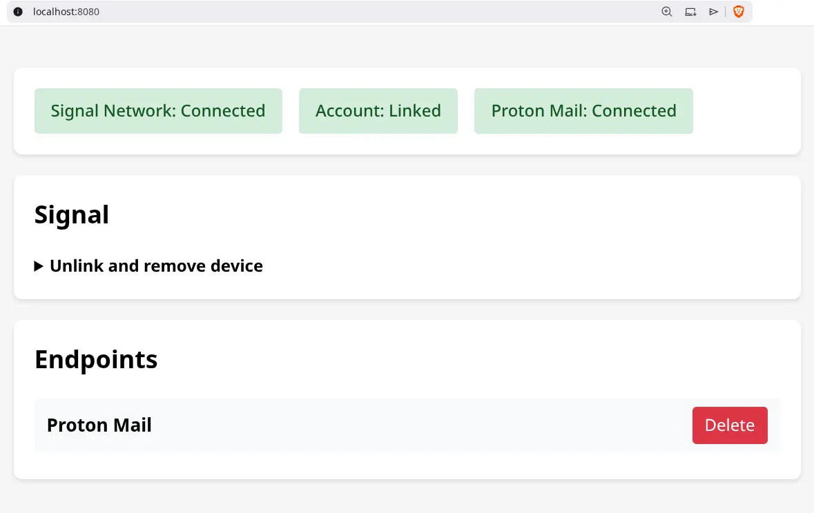

<div align="center">


# SUP

**SUP (Signal Unified Push) is a privacy-preserving push notification system using Signal as transport**

[Setup](#setup) • [Real-World Examples](#real-world-examples) • [Architecture](#architecture)

</div>

<!-- markdownlint-enable MD033 -->

> ⚠️ **Early Alpha**: SUP is under rapid development. The Android app is being actively developed and the current version is not thoroughly tested. There are no stable releases yet. Use at your own risk.

SUP is a [UnifiedPush](https://unifiedpush.org/) server and distributor that routes push notifications through Signal, allowing you to receive app notifications without exposing unique network fingerprints to any network observers. All notification traffic appears as regular Signal messages.

## Why?

Traditional push notification systems require persistent connections to specific servers, creating unique network fingerprints. Relying on traditional push notification services like Android's built-in FCM (Firebase Cloud Messaging) may also expose your notification metadata. SUP blends your notification traffic with regular Signal usage for better privacy.

SUP also includes an optional Proton Mail integration, allowing you to receive email notifications as Signal messages without exposing IMAP connections.

Note that you'll need to run SUP on your own server (either at home or on a VPS) since it uses your personal Signal and Proton Mail credentials. A Raspberry Pi, which is a small and affordable micro-computer, works perfectly for this, using minimal power (3-5W) while running SUP 24/7.

## How?

SUP functions as a UnifiedPush server to proxy http-based requests to Signal groups via [signal-cli](https://github.com/AsamK/signal-cli).

For the optional ProtonMail integration, SUP requires a server that runs Proton's official [proton-bridge](https://github.com/ProtonMail/proton-bridge). SUP's docker compose process will run an image from [protonmail-bridge-docker](https://github.com/shenxn/protonmail-bridge-docker). Once authenticated, the communication between SUP and proton-bridge will be over IMAP.

## Setup

### 1. Install Android App (Optional)

An Android app is optionally available to connect UnifiedPush Android apps to the SUP server. It can also provide a better experience for displaying SUP-based notifications if the `ENABLE_ANDROID_INTEGRATION` environment variable is enabled on the server.

Download the latest APK from [GitHub Releases](https://github.com/lone-cloud/sup/releases).

**Certificate Fingerprint:**

```text
0D:3C:99:15:0E:12:1A:DE:0D:AE:05:CB:16:46:5E:65:31:56:DC:D6:98:87:59:4E:79:B1:0D:AE:1E:56:F2:E8
```

### 2. Proton Mail Integration (Optional)

A Proton Mail Bridge is optionally available if you want to receive push notifications for incoming emails.

> **Note:** The default Proton Mail Bridge image uses `shenxn/protonmail-bridge:build` which compiles from source and supports multiple architectures. For x86_64 systems, you can use `shenxn/protonmail-bridge:latest` (pre-built binary, smaller and faster). For ARM devices (Raspberry Pi), stick with `:build`.

To receive Proton Mail notifications via Signal:

1. **Initialize Proton Mail Bridge** (one-time setup):

```bash
# Download docker-compose.yml
curl -L -O https://raw.githubusercontent.com/lone-cloud/sup/master/docker-compose.yml

docker compose run --rm protonmail-bridge init
```
  
2.**Login to Proton Mail Bridge**:

- At the `>>>` prompt, run: `login`
- Enter your email
- Enter your password
- Enter your 2FA code

3.**Get IMAP credentials**:

- Run: `info`
- Copy the Username and Password shown
- Run: `exit` to quit

4.**Add credentials to .env**:

```bash
# Add these to your .env file
PROTON_IMAP_USERNAME=bridge-username-from-info-command
PROTON_IMAP_PASSWORD=bridge-generated-password-from-info-command
```

5.**Start all services with Proton Mail**:

```bash
docker compose --profile protonmail up -d
```

Your phone will now receive Signal notifications when Proton Mail receives new emails.

Note that the bridge will first need to sync all of your old emails before you can start getting new email notifications which may take a while, but this is a one-time setup.

### 3. SUP Server integration

```bash
# Download docker-compose.yml
curl -L -O https://raw.githubusercontent.com/lone-cloud/sup/master/docker-compose.yml

# Download .env.example (optional)
curl -L -O https://raw.githubusercontent.com/lone-cloud/sup/master/server/.env.example

# Configure SUP server through environment variables (optional)
cp .env.example .env
nano .env

# Start SUP server
docker compose up -d

```

### 4. Configuration

Link your Signal account (one-time setup)
Visit localhost:8080 and scan QR code with Signal app

#### Authenticate with the API_KEY



#### Scan the QR code from your Signal app by linking SUP as a device



#### A healthy setup with a linked account



#### A healthy setup with a linked account and the optional Proton Mail integration




### Development

For local development, install Bun and signal-cli:

```bash
# Install Bun (use your package manager and this is a backup)
curl -fsSL https://bun.sh/install | bash

git clone https://github.com/lone-cloud/sup.git
cd sup

bun install
cd server
bun start
```

Then build and run with docker-compose.dev.yml:

```bash
docker compose --profile protonmail -f docker-compose.dev.yml up -d
```

or just the proton-bridge:

```bash
docker compose -f docker-compose.dev.yml up protonmail-bridge
```

## Real-World Examples

### Proton Mail Notifications

Receive instant Signal notifications when new emails arrive in your Proton Mail inbox. SUP monitors your Proton Mail account via the local Proton Mail Bridge and forwards email alerts through Signal, eliminating the need for persistent IMAP connections from your phone.

### Home Assistant Alerts

Add a rest notification configuration (eg. add to configuration.yaml) to Home Assistant like:

```bash
notify:
  - platform: rest
    name: SUP
    resource: "http://<Your SUP server network IP>/Home Assistant"
    method: POST
    data:
      package: "io.homeassistant.companion.android"
    headers:
      Authorization: !secret sup_basic_auth
```

Add the Base64 version of your API_KEY environment variable secret to your secrets.yaml. This secret must be prepended by a colon and the simplest way to get this value is to run `btoa(':<API_KEY>')` in your browser's console.

```bash
sup_basic_auth: "Basic <Base64 Hash value>"
```

Reboot your Home Assistant system and you'll then be able to send Signal notifications to yourself by using this notify sup action.  

## Architecture


SUP consists of two services that **MUST rSUP uses [basic access authentication](https://en.wikipedia.org/wiki/Basic_access_authentication) for authentication. un together on the same machin`API_KEY` as a password and the username can be ignored.

For API-based monitoring, you can call `/api/health` which will return JSON health output like:

```JSON
{"uptime":"3s","signal":{"daemon":"running","linked":true},"protonMail":"connected"}
```
**:

- **sup-server** (Bun): Receives webhooks, sends Signal messages via signal-cli. Optional: monitors Proton Mail IMAP
- **protonmail-bridge** (Official Proton, optional): Decrypts Proton Mail emails, runs local IMAP server

All services communicate over a private Docker network with no external exposure except Signal protocol. **Separating these services across multiple machines would expose plaintext IMAP traffic and compromise security.**

**Android App** (Kotlin): Monitors Signal notifications, extracts UnifiedPush payloads, delivers to apps
