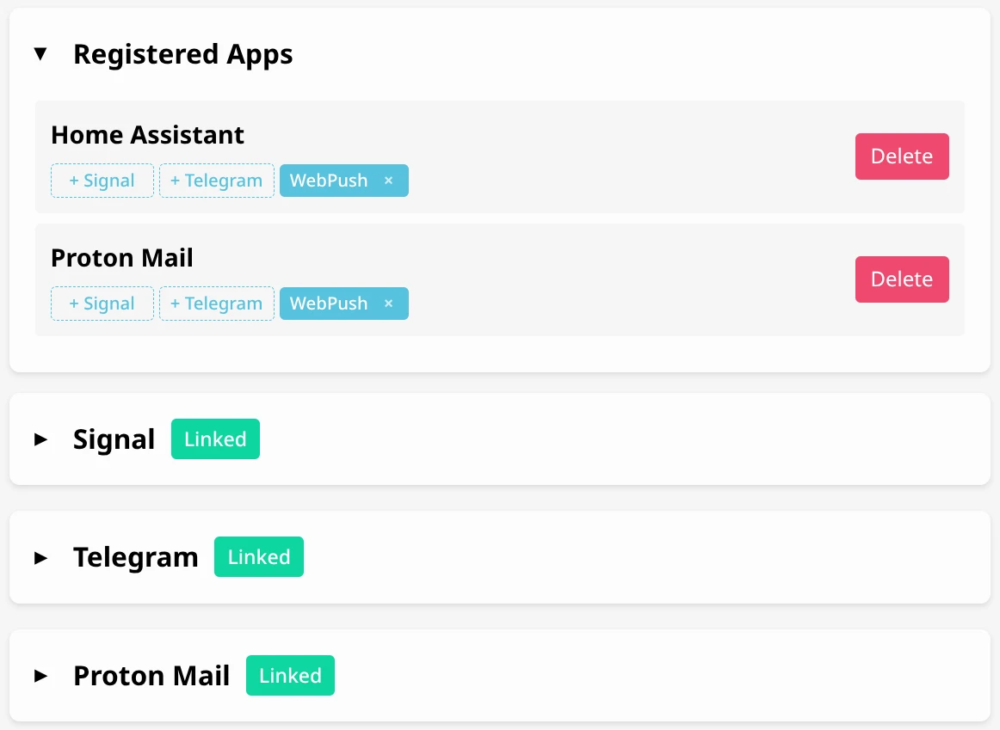

<div align="center">


# Prism

**Self-hosted notification gateway with email monitoring**

[Setup](#setup) • [Integrations](#integrations) • [Examples](#real-world-examples)

</div>

<!-- markdownlint-enable MD033 -->

Prism is a self-hosted notification gateway. Prism can receive messages and route them to Signal, Telegram or WebPush URLs. Messages can be sent via webhooks or monitored from a Proton Mail account integration.

## Setup

### Docker (Recommended)

```bash
# Create .env file
curl -L -O https://raw.githubusercontent.com/lone-cloud/prism/master/.env.example
mv .env.example .env
nano .env  # Set API_KEY=your-secret-key-here

# Run Prism
docker run -d \
  --name prism \
  -p 8080:8080 \
  -v prism-data:/app/data \
  -v signal-data:/home/prism/.local/share/signal-cli \
  --env-file .env \
  ghcr.io/lone-cloud/prism:latest
```

### Binary (Alternative)

```bash
# Download latest release
curl -L -O https://github.com/lone-cloud/prism/releases/latest/download/prism-linux-amd64
chmod +x prism-linux-amd64
mv prism-linux-amd64 prism

# Create .env file
curl -L -O https://raw.githubusercontent.com/lone-cloud/prism/master/.env.example
mv .env.example .env
nano .env  # Set API_KEY=your-secret-key-here

# Run Prism
./prism
```

Prism is now running at <http://localhost:8080>.



## Integrations

All integrations are configured through the web UI - no environment variables or command-line setup needed!

Authenticate using your `API_KEY` as the password (username can be anything).

### Signal

Send notifications through Signal Messenger.

**Setup:**

1. Visit <http://localhost:8080> and authenticate with your API_KEY
2. Expand the Signal integration card
3. Click "Link Device"
4. Scan the QR code with Signal on your phone:
   - Open Signal → Settings → Linked Devices → Link New Device
   - Scan the displayed QR code
5. Your device will link automatically

All notifications will be sent via Signal.

**Note:** If running the binary directly (not Docker), you'll need [signal-cli](https://github.com/AsamK/signal-cli/releases) installed and in your PATH. Docker images include signal-cli automatically.

### Telegram

Send notifications through a Telegram bot.

**Setup:**

1. Create a bot:
   - Message [@BotFather](https://t.me/BotFather) on Telegram
   - Send `/newbot` and follow the prompts
   - Copy the bot token

2. Get your Chat ID:
   - Message [@userinfobot](https://t.me/userinfobot) on Telegram
   - Copy your Chat ID from the response

3. Configure in Prism:
   - Visit <http://localhost:8080> and authenticate with your API_KEY
   - Expand the Telegram integration card
   - Enter your bot token and chat ID
   - Click "Configure"

All notifications will be sent to your Telegram chat.

### Proton Mail

Monitor a Proton Mail account and forward new emails as notifications through Signal or Telegram.

**Features:**

- Monitors inbox for new emails in real-time
- Supports 2FA-enabled accounts
- Auto-creates "Proton Mail" app for received emails
- Secure credential storage with AES-256-GCM encryption
- Automatic token refresh - no re-authentication needed

**Setup:**

1. Visit <http://localhost:8080> and authenticate with your API_KEY
2. Configure Signal or Telegram first (required for routing)
3. Expand the Proton Mail integration card
4. Enter your Proton Mail credentials:
   - Email address
   - Password
   - 2FA code (if enabled)
5. Click "Link"

Proton Mail will connect and begin monitoring. New emails will appear as notifications from the "Proton Mail" app.

**Note:** Prism uses the official Proton Mail API (same as the Proton Bridge). Credentials are encrypted and stored locally. Tokens refresh automatically in the background.

### WebPush

Send notifications directly to your browser.

**Setup:**

1. Visit <http://localhost:8080> and authenticate with your API_KEY
2. Allow browser notifications when prompted
3. Apps without Signal or Telegram configured will automatically use WebPush

You'll receive browser notifications when messages arrive.

## Real-World Examples

### Email Monitoring

Receive instant Signal or Telegram notifications when new emails arrive in your Proton Mail inbox.

Prism monitors your Proton Mail account using the official Proton API and forwards new emails as notifications. Perfect for monitoring important accounts without constantly checking email.

### Home Assistant Alerts

Add a rest notification configuration (eg. add to configuration.yaml) to Home Assistant like:

```yaml
notify:
  - platform: rest
    name: Prism
    resource: "http://<Your Prism server network IP>/Home Assistant"
    method: POST
    headers:
      Authorization: !secret prism_api_key
```

Since Home Assistant and Prism are both on your local network, HTTP is allowed automatically - no additional configuration needed.

Add your API_KEY to your secrets.yaml:

```bash
prism_api_key: "Bearer YOUR_API_KEY_HERE"
```

Reboot your Home Assistant system and you'll then be able to send Signal notifications to yourself by using this notify prism action.

## API Reference

### Send Notification

#### POST /{appName}

Send a notification to a specific app. Messages are routed based on your app configuration in the web UI.

JSON format:

```bash
curl -X POST http://localhost:8080/my-app \
  -H "Authorization: Bearer YOUR_API_KEY" \
  -H "Content-Type: application/json" \
  -d '{"title": "Alert", "message": "Something happened"}'
```

Plain text (ntfy-compatible):

```bash
curl -X POST http://localhost:8080/my-app \
  -H "Authorization: Bearer YOUR_API_KEY" \
  -d "Simple message text"
```

**App Routing:**
- Configure which integration(s) receive messages from each app via the web UI
- Apps can route to Signal, Telegram, WebPush, or multiple destinations
- Special apps like "Proton Mail" are created automatically

### WebPush/Webhook Management

#### POST /api/v1/webpush/app

Register or update a WebPush subscription or plain webhook.

Encrypted WebPush (all crypto fields required):

```bash
curl -X POST http://localhost:8080/api/v1/webpush/app \
  -H "Authorization: Bearer YOUR_API_KEY" \
  -H "Content-Type: application/json" \
  -d '{
    "appName": "my-app",
    "pushEndpoint": "https://updates.push.services.mozilla.org/...",
    "p256dh": "base64-encoded-key",
    "auth": "base64-encoded-auth",
    "vapidPrivateKey": "base64-encoded-vapid-key"
  }'
```

Plain HTTP webhook (no encryption):

```bash
curl -X POST http://localhost:8080/api/v1/webpush/app \
  -H "Authorization: Bearer YOUR_API_KEY" \
  -H "Content-Type: application/json" \
  -d '{
    "appName": "my-app",
    "pushEndpoint": "https://your-server.com/webhook"
  }'
```

#### DELETE /api/v1/webpush/app/{appName}

Unregister a WebPush subscription (clears WebPush settings, reverts to Signal).

```bash
curl -X DELETE http://localhost:8080/api/v1/webpush/app/my-app \
  -H "Authorization: Bearer YOUR_API_KEY"
```

## Monitoring

### Health Endpoints

#### GET /health

Public health check endpoint (no authentication required). Returns `200 OK` when the service is running. Used for Docker health checks and load balancer health probes.

```bash
curl http://localhost:8080/health
```

#### GET /api/v1/health

Detailed health endpoint (requires authentication). Returns JSON with uptime and integration status:

```bash
curl http://localhost:8080/api/v1/health \
  -H "Authorization: Bearer YOUR_API_KEY"
```

```json
{
  "version": "0.2.0",
  "uptime": "2h15m",
  "signal": {"linked": true, "account": "+1234567890"},
  "telegram": {"linked": true, "account": "123456789"},
  "proton": {"linked": true, "account": "user@proton.me"}
}
```

## API Key Security

Your API_KEY is both the login password and the master encryption key for all integration credentials. Use a strong unique password. Changing it will make all encrypted credentials unrecoverable.
