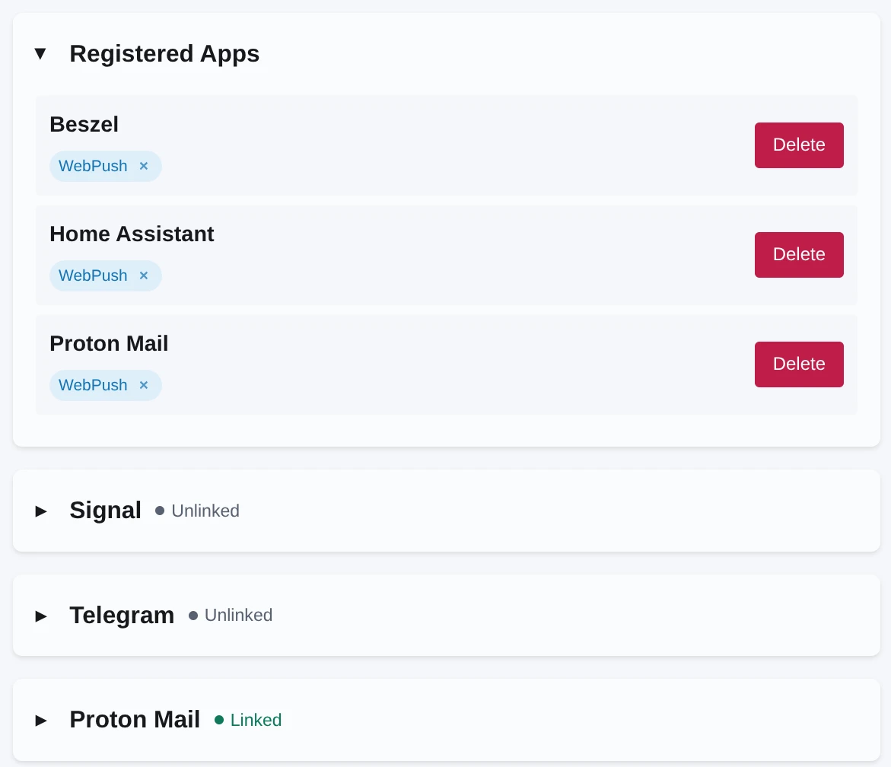
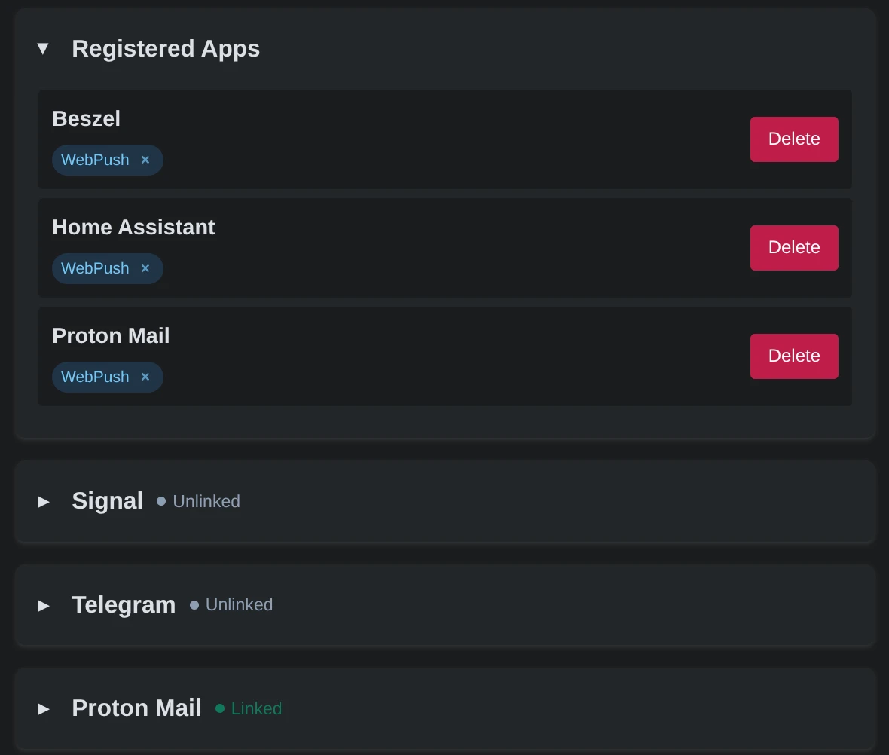

<div align="center">


# Prism

**Private notification gateway**

[Setup](#setup) • [Integrations](#integrations) • [API](#api) • [Examples](#real-world-examples) • [Monitoring](#monitoring)

</div>

<!-- markdownlint-enable MD033 -->

Prism sits between your services and your phone. Services send HTTP notifications; Prism delivers them to Signal, Telegram or WebPush. Prism is ntfy-compatible, so existing integrations work without changes. It can optionally monitor a Proton Mail inbox and send a notification for new emails.

Android companion app: [prism-android](https://github.com/lone-cloud/prism-android)

<p align="center">
  
  
</p>

## Setup

### Docker (Recommended)

```bash
curl -L -O https://raw.githubusercontent.com/lone-cloud/prism/master/.env.example
mv .env.example .env
nano .env  # Set API_KEY=your-secret-key-here

curl -L -O https://raw.githubusercontent.com/lone-cloud/prism/master/docker-compose.yml
docker compose up -d
```

### Binary (Alternative)

```bash
curl -L -O https://github.com/lone-cloud/prism/releases/latest/download/prism-linux-amd64
chmod +x prism-linux-amd64
mv prism-linux-amd64 prism

curl -L -O https://raw.githubusercontent.com/lone-cloud/prism/master/.env.example
mv .env.example .env
nano .env  # Set API_KEY=your-secret-key-here

./prism
```

Prism is now running at <http://localhost:8080>.

## Security

**Deploy behind HTTPS.** Every API request sends your `API_KEY` in the `Authorization` header. Over plain HTTP that header is transmitted in cleartext — anyone who can observe the traffic between your callers and the server can read the key and make authenticated requests. Use a reverse proxy with TLS termination (Caddy, nginx, Traefik) or a tunnel service like Cloudflare Tunnel in front of Prism.

Only use http URLs when callers run on the same host and traffic never leaves the machine.

## Integrations

All integrations are configured through the web UI. Authenticate with your `API_KEY` as the password (username can be anything).

### Signal

Send notifications through Signal Messenger.

**Setup:**

1. Visit <http://localhost:8080> and authenticate with your API_KEY
2. Expand the Signal integration card
3. Click "Link Device"
4. Scan the QR code with Signal on your phone:
   - Open Signal → Settings → Linked Devices → Link New Device
   - Scan the displayed QR code
5. Your device will link automatically

> **Note:** Binary installs require [signal-cli](https://github.com/AsamK/signal-cli/releases) in your PATH. Docker includes it automatically.

### Telegram

Send notifications through a Telegram bot.

**Setup:**

1. Create a bot:
   - Message [@BotFather](https://t.me/BotFather) on Telegram
   - Send `/newbot` and follow the prompts
   - Copy the bot token

2. Get your Chat ID:
   - Message [@userinfobot](https://t.me/userinfobot) on Telegram
   - Copy your Chat ID from the response

3. Configure in Prism:
   - Visit <http://localhost:8080> and authenticate with your API_KEY
   - Expand the Telegram integration card
   - Enter your bot token and chat ID
   - Click "Configure"

### Proton Mail

Monitor a Proton Mail account and forward new emails as notifications through Signal or Telegram.

**Setup:**

1. Visit <http://localhost:8080> and authenticate with your API_KEY
2. Configure Signal or Telegram first (required for routing)
3. Expand the Proton Mail integration card
4. Enter your Proton Mail credentials:
   - Email address
   - Password
   - 2FA code (if enabled)
5. Click "Link"

New emails appear as notifications from the "Proton Mail" app. Credentials are encrypted (AES-256-GCM) and tokens refresh automatically.

### WebPush

Send notifications directly to your browser.

**Setup:**

1. Visit <http://localhost:8080> and authenticate with your API_KEY
2. Allow browser notifications when prompted
3. Apps without Signal or Telegram configured will automatically use WebPush

## API

All API endpoints require authentication with your API key:

```bash
Authorization: Bearer YOUR_API_KEY
```

### ntfy-compatible publish API

Publish notifications to `POST /{appName}`.

`{appName}` is the target app/topic name. Messages are routed to all subscriptions configured for that app (Signal, Telegram, WebPush).

**JSON payload:**

```bash
curl -X POST http://localhost:8080/my-app \
  -H "Authorization: Bearer YOUR_API_KEY" \
  -H "Content-Type: application/json" \
  -d '{"title": "Alert", "message": "Something happened"}'
```

**JSON payload with image:**

```bash
curl -X POST http://localhost:8080/my-app \
  -H "Authorization: Bearer YOUR_API_KEY" \
  -H "Content-Type: application/json" \
  -d '{"title": "Motion Detected", "message": "Front door", "attach": "https://example.com/snapshot.jpg"}'
```

**Plain text payload:**

```bash
curl -X POST http://localhost:8080/my-app \
  -H "Authorization: Bearer YOUR_API_KEY" \
  -d "Simple message text"
```

### WebPush subscription API

Register and remove WebPush subscriptions for an app.

#### POST /api/v1/webpush/subscriptions

Creates a WebPush subscription.

Required fields:

- `appName`
- `pushEndpoint`

Optional encrypted payload fields (must be provided together):

- `p256dh`
- `auth`
- `vapidPrivateKey`

```bash
curl -X POST http://localhost:8080/api/v1/webpush/subscriptions \
  -H "Authorization: Bearer YOUR_API_KEY" \
  -H "Content-Type: application/json" \
  -d '{
    "appName": "my-app",
    "pushEndpoint": "https://example.push.service/send/abc123",
    "p256dh": "BASE64URL_P256DH",
    "auth": "BASE64URL_AUTH",
    "vapidPrivateKey": "BASE64URL_VAPID_PRIVATE_KEY"
  }'
```

Minimal registration (without encrypted payload fields):

```bash
curl -X POST http://localhost:8080/api/v1/webpush/subscriptions \
  -H "Authorization: Bearer YOUR_API_KEY" \
  -H "Content-Type: application/json" \
  -d '{
    "appName": "my-app",
    "pushEndpoint": "http://localhost:9001/mock-push"
  }'
```

#### DELETE /api/v1/webpush/subscriptions/{subscriptionId}

Removes a WebPush subscription by ID.

```bash
curl -X DELETE http://localhost:8080/api/v1/webpush/subscriptions/SUBSCRIPTION_ID \
  -H "Authorization: Bearer YOUR_API_KEY"
```

## Real-World Examples

### Home Assistant

Add to `configuration.yaml`:

```yaml
notify:
  - platform: rest
    name: Prism
    resource: "http://<Your Prism server network IP>/Home Assistant"
    method: POST_JSON
    headers:
      Authorization: !secret prism_api_key
    data_template:
      title: "{{ title }}"
      message: "{{ message }}"
      image: "{{ data.image | default('') }}"
```

Add to `secrets.yaml`:

```bash
prism_api_key: "Bearer YOUR_API_KEY_HERE"
```

Then use the `notify.prism` action in automations.

**Sending an image from a camera snapshot:**

```yaml
action: notify.prism
data:
  title: "Motion Detected"
  message: "Front door camera triggered"
  data:
    image: "https://example.com/snapshot.jpg"
```

### Beszel

In [Beszel](https://beszel.dev)'s **Settings → Notifications**, add:

```
ntfy://:YOUR_API_KEY@<prism-host>:<port>/Beszel?disableTLS=yes
```

`disableTLS=yes` is only needed for local HTTP. The app name (`Beszel`) can be anything.

## Monitoring

### Health Endpoints

#### GET /health

Public. Returns `200 OK` when running.

```bash
curl http://localhost:8080/health
```

#### GET /api/v1/health

Authenticated. Returns uptime and integration status:

```bash
curl http://localhost:8080/api/v1/health \
  -H "Authorization: Bearer YOUR_API_KEY"
```

```json
{
  "version": "1.2.0",
  "uptime": "2h15m",
  "signal": {"linked": true, "account": "+1234567890"},
  "telegram": {"linked": true, "account": "123456789"},
  "proton": {"linked": true, "account": "user@proton.me"}
}
```
